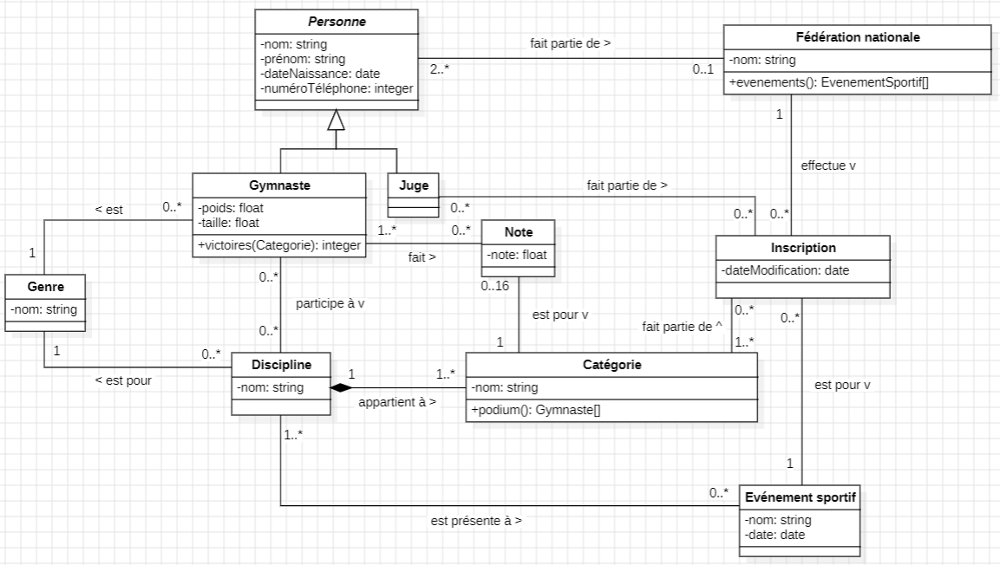

# POO - Labo 03

**Groupe** : L03GrK

## Diagramme

## Contraintes d'intégrité

- Une fédération nationale a au moins un gymnaste et un juge. 
- Les gymnastes participant à la discipline doivent avoir le même genre que le genre de la discipline.
- Si une discipline est inscrite à un événement, toutes les catégories qui le composent aussi.
- Une inscription à un évènement a au moins une personne (un gymnaste ou un juge).

## Hypothèses de travail:

- Nous avons modelisé la classe abstraite `Personne` afin de regrouper les caractéristiques communes aux gymnastes et aux juges.
- Nous avons modélisé la classe `Genre` afin de ne pas dupliquer l'attribut *genre* dans `Gymnaste` et dans `Discipline`.
- Une fédération nationale peut ne pas s'inscrire à un événement sportif, d'où la cardinalité `0..*` sur `Inscription`.
- Un juge peut ne pas être envoyé à un événement sportif et une inscription peut ne pas avoir de juge d'où les cardinalités `0..*` sur `Inscription` et `Juge`.
- Un événement sportif peut ne pas avoir d'inscriptions, mais une inscription est forcément dans un et un seul événement sportif.
- Une catégorie peut ne pas être dans une inscription, mais une inscription a forcément une catégorie.
- Une discipline peut ne pas être dans un événement sportif, mais un événement sportif a forcément une discipline.
- Une discipline est forcément genrée (il n'y a pas de discipline mixte), mais un genre peut ne faire partie d'aucune discipline.
- Un gymnaste a forcément un genre, mais un genre peut n'être attribué à aucun gymnaste.
- Un gymnaste peut ne participer à aucune discipline et une discipline peut n'avoir aucun gymnaste.
- Il y a une composition entre `Discipline` et `Catégorie`. En effet, sans une catégorie, une discipline ne peut pas exister et une catégorie ne peut qu'être dans une discipline.
- Nous ne passons pas de paramètre à la fonction `podium()` car les notes des gymnastes ainsi que l'inscription (contenant l'évènement) sont atteignables depuis la classe catégorie.
- Pour la fonction `victoires()` nous passons une catégorie en paramètre afin d'en déduire si le gymnaste est sur le podium ou non.
